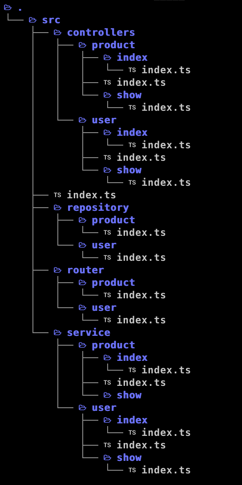

# インターンでの成果
## 初めに
現在私はインターン先で1年半以上サーバサイドを経験しています。そこで溜まった知見をアウトプットとしてここにまとめたいと思います。また、携わったプロジェクトの関係上ソースコードを載せることができないため、ブログのような形で説明します。 <br>
クリーンアーキテクチャや自分の作った関数についてまとめていきます。

## クリーンアーキテクチャ
基本的にクリーンアーキテクチャを採用しており、以下の図のような構成になっております。
 <br>
コードの流れは、 <br>
`router → controller → service (dto) → redis → repository`となっています。

### ディレクトリ構成
各層の説明
- router <br>
  APIのパスを表している。ディレクトリ構成をパスと同じにすることで分かりやすくしている。 <br>
- controller <br>
  APIのリクエストを受け取り、レスポンスを返している。リクエストボディのバリデーションなども行なっている。 <br>
- service <br>
  ビジネスロジックを行なっている。また、DTOも行なっていて別にDTOを行う関数を分けている。 <br>
- repository <br>
  DBからエンティティの取得を行なっている。 <br>
- dto <br>
  service層で呼ばれる。repository層から取得してきたエンティティの整形のみをしている。バリデーションはここでは行わない。 <br>
- redis <br>
  キャッシュにRedisを利用していて、service層とrepository層の中継的な役割を担っている。キャッシュがあればrepositoryを呼ばずにそのままserviceに返している。 <br>

`controller`と`service`などでディレクトリ、ファイルを細かく分けてあるが、これはAPIごとにファイルを分けていて、ディレクトリを辿れば何のAPIか分かるようにしている。また、一つのファイルの大きさが小さくなるので、可読性や保守性が上がります。

### DI
各層では、依存性を作らないためにDIを行なっています。以下はcontroller層とservice層のコードで、最初にservice、redisを受け取ることでDIを行なっています。 <br>
詳しい説明は[こちら DIについて](DI.md)
```typescript:src/controller/user/show/index.ts
import { usersService, UsersService } from '~/src/services/users';

type ShowIF = (usersService: UsersService) => Show;
export type Show = DefaultRouteHandlerMethod<ShowMethod>;
type ShowMethod = {
  Querystring: CreateRequestBody;
  Reply: ProcessedUser;
};

const showIF: ShowIF = (usersService) => {
  return async (req, res) => {
    // LOGGER
    const logger = usersLogger.show.new();

    try {
      // GET PRISMA
      const prisma = getPrismaClientReadOnly();

      // LOG
      logger.stack('function_at', 'userShowController');
      logger.stack('request_query', req.query);

      // UDID
      const udid = req.body;
      validateUDID(udid);
      logger.stack('udid', udid);

      // JWT
      const jwt_payload = req.token_payload;
      const jwt_ids = getJWTIds(jwt_payload);
      logger.stack('jwt_ids', jwt_ids);

      // PROCESSED
      const user = await usersService.show(
        prisma,
        udid,
        jwt_ids,
      );
      logger.stack('user', user);

      logger.push();
      return user;
    } catch (error) {
      // LOG
      logger.stack('error', error);

      logger.push();
      return replyErrorByErrorInstance(res, error);
    }
  };
};

export const show = showIF(usersService);
```
```typescript:src/service/user/show/index.ts
import { userRedis, UserRedis } from '~/src/redis/user';

type ShowIF = (usersRedis: UsersRedis) => Show;
export type Show = (
  prisma: PrismaClient,
  udid: UDID,
  jwt_ids: JWTIds,
) => Promise<ProcessedUser>;

const showIF: ShowIF = (usersRedis) => {
  return async (prisma, udid, jwt_ids) => {
    // LOGGER
    const logger = usersLogger.show.extends();
    logger.stack('function_at', 'userShowService');

    // JWT
    const { jwt_id, jwt_aud } = jwt_ids;

    // GET BOTH
    const [user_auth_udid, user_auth_jwt] = await Promise.all([
      usersRedis.findUDIDWithUserinPromise(prisma, udid),
      usersRedis.findJWTWithUserinPromise(prisma, jwt_id),
    ]);
    logger.stack('user_auth_udid', user_auth_udid);
    logger.stack('user_auth_jwt', user_auth_jwt);

    // RAW USER
    const raw_user = user_auth_jwt.user;

    // DTO
    const processed_user: ProcessedUser = usersDTO.rawToProcessed(raw_user);
    return processed_user;
  };
};

export const show = showIF(usersRedis);
```

